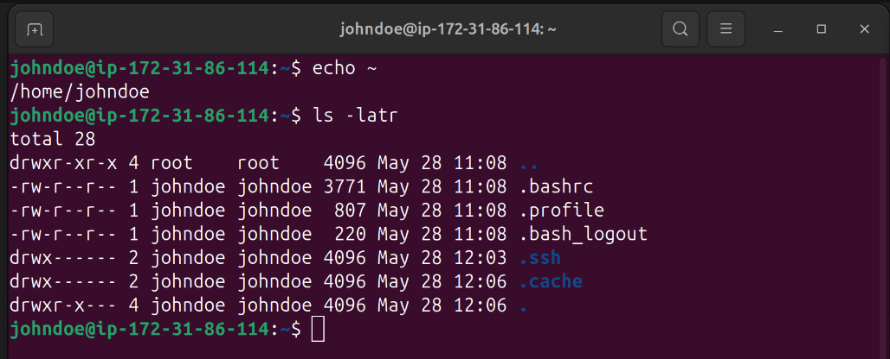

# Advanced Linux commands
## This Project Demonstrates advanced linux commands and how to use them.

### Basic File Permissions
Linux assigns permissions to three types of users:

* Owner (User) – The user who created the file.

* Group – Users who are part of a specific group.

* Others (World) – All other users on the system.

### Each file/directory has three types of permissions:

* Read (r) – Allows viewing file contents or listing directory contents.

* Write (w) – Allows modifying file contents or creating/deleting files in a directory.

* Execute (x) – Allows running a file as a program or accessing a directory.

### Viewing Permissions

* Run `ls -l` to see permissions


*-rw-r--r-- 1 user group 1024 May 25 10:00 file.txt*

* The first part (-rw-r--r--) shows permissions:

   *  = File type (- for file, d for directory).

  * rw- = Owner permissions (read, write).

  - r-- = Group permissions (read).

  - r-- = Others permissions (read).

  ### Changing Permissions with `chmod`

  #### Use chmod to modify permissions in two ways:

  **Symbolic Mode(u,g,o,a)**

  * u (user/owner), g (group), o (others), a (all).
  * +(add), - (remove), = (set exactly).

  #### Examples

  ```bash
  chmod u+x script.sh    # Add execute for owner
  chmod g-w file.txt     # Remove write for group
  chmod o=r-- file.txt   # Set others to read-only
  chmod a+rw file.txt    # Give read-write to all
  ```


#### Numeric Mode (Octal)
* Each permission has a number:
  - 4 = Read (r)

  - 2 = Write (w)

  - 1 = Execute (x) 

* Combine them (e.g., 7 = 4+2+1 for rwx).

#### Example:

```bash
chmod 755 script.sh    # rwxr-xr-x (Owner: rwx, Group/Others: r-x)
chmod 644 file.txt     # rw-r--r-- (Owner: rw-, Group/Others: r--)
```
### Create a file, check and change permision

* Run `touch script.sh` to create the file
* Run `ls -latr script.sh` to check permission
* Run `chmod +x` to add execute permission
* Run `chmod 755` to add execute permission to user, group and others


### Create a text file and check permissions
* Run `touch file.txt`
* Run `chmod 777 file.txt`
* Run `ls -latr note.txt`


### Changing Ownership with `chown` & `chgrp`
* **chown** changes the *owner* of a file:

```bash
chown user file.txt
chown user:group file.txt
```
* **chgrp** changes the *group*:
```bash
chgrp group file.txt
```
### Change ownership of script.sh to user named johndoe who is in developers group.
* Run `sudo chown johndoe:developers /home/ubuntu/script.sh`


### Super User privilleges
- The superuser, or we can say root, is a special user account used for system administration purposes on Linux. They have all rights on the files like read write execute. However, if you are the root user and want to perform administrative task, prefix the command with `sudo`
* Run `sudo -i` to switch account to root. Type `exit` to switch back to your user account.


### Create a new user account
* Run `sudo adduser johndoe` to create a user named johndoe


* Run `sudo usermod -aG sudo johndoe` to add johndoe to sudo group which give johnedoe administrative privileges.


## Connecting to ec2 instance as johndoe.
### Copy existing key Run the following commnads

```bash
sudo mkdir -p /home/johndoe/.ssh #Create .ssh folder in johndoes's home dir
sudo cp ~/.ssh/authorized_keys /home/johndoe/.ssh/ #Copy authorised key to johnedoe .ssh folder.
sudo chown -R johndoe:johndoe /home/johndoe/.ssh
sudo chmod 700 /home/johndoe/.ssh
sudo chmod 600 /home/johndoe/.ssh/authorized_keys
```


* `chown` → "Change owner" (the command to modify ownership).
* `-R`→ Recursive, meaning it applies to
    - The specified directory and
    - All files/subdirectories inside it.

* `john:john` → Sets:
    - User owner = john
    - Group owner = john

* `/home/johndoe/.ssh` → The target director

### Now connect to the ec2 as john doe
* log out as user ubuntu
* Run `ssh -i /path/to/key.pem johndoe@ec2-18-209-60-216.compute-1.amazonaws.com`


* Run `echo ~` to see home directory of johndoe


* Run `cd /home/johndoe` to get to johndoe's home directory.


### Switch User Accounts
* Type 'exit' to leave johndoe account
* Run `su johndoe` to login as user johndoe, type password when prompted.


* Run `ls -latr` to see files and directories in johndoe's home dir



### Changing User Password.

* To change johndoe's password run `sudo passwd johndoe`


* To login with the updated password for user johndoe. Run `su johndoe`


### Create a group

* To create a group run `sudo groupadd developers` to create a group named developers.


* Run `getent group devops` to verify group creation.


* To add johndoe to the developers group run `sudo usermod -aG developers johndoe`. Then run `id johndoe` to verify user group.


### Deleting a user

* Run `sudo userdel jonmark` to delete a user named jonmark


### Group Permission

* To give members of developers group access to developer directory. Run `sudo chown :developers /path/to/directory`


* To add read and write permission. Run `sudo chmod g+rw /path/to/directory`


### Create a group named 'devops'

* Run `sudo groupadd devops` to create devops group.
* Run `getent group devops` to verify creation of devops group.


### Create 5 Users, Mary, Mohammed, Ravi, Tunji and Sofia.

```bash
sudo useradd -m -G devops mary
sudo useradd -m -G devops mohammed
sudo useradd -m -G devops ravi
sudo useradd -m -G devops tunji
sudo useradd -m -G devops sofia
```


* -m → Creates a home directory for the user
* -G devops → Adds the user to the devops group.

### Verify group creation

* Run `group ussername` to see group user belong to.


### Create workspace folder for each user
```bash
sudo mkdir /home/mary/workspace
sudo mkdir /home/mohammed/workspace
sudo mkdir /home/ravi/workspace
sudo mkdir /home/tunji/workspace
sudo mkdir /home/sofia/workspace
```


### Set Ownership to devops Group & Correct Permissions
```bash
sudo chown mary:devops /home/mary/workspace
sudo chown mohammed:devops /home/mohammed/workspace
sudo chown ravi:devops /home/ravi/workspace
sudo chown tunji:devops /home/tunji/workspace
sudo chown sofia:devops /home/sofia/workspace

# Set permissions (770 = Owner & Group have full access, Others have none)
sudo chmod 770 /home/*/workspace
```


### Verify users and gruops
* To see a user group and permissions. Run `sudo ls -ld /home/user/workspace`


### Verify All Users Can Access Their Folders

* Run the set of command below to verify if users can access their workspace

```bash
sudo su - mary
cd ~/workspace
touch test_file
ls -l  # Should show the file owned by 'mary' with group 'devops'
exit
```


### Verify members of devops group
* Run `getent group devops`


### Special Permissions.
* Set User ID (SUID) (4) – Executes as the owner (e.g., **chmod 4755**).

* Set Group ID (SGID) (2) – Executes as the group (e.g., **chmod 2755**).

* Sticky Bit (1) – Only the owner can delete files in a directory (e.g., **/tmp**):

  - `chmod +t /shared_dir`


